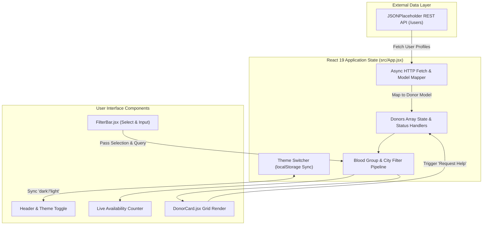

# Hema — Community Blood Donor Finder 🩸

> **Real-time open-source community platform connecting emergency blood seekers with available local blood donors.**

[](https://react.dev)
[](https://vite.dev)
[](https://eslint.org)
[](LICENSE)
[](docs/CONTRIBUTING.md)

---

## 📌 What is Hema?

**Hema** is a lightweight, high-performance web application designed to bridge the gap between patients in critical need of blood transfusions and voluntary blood donors. Built using **React 19** and **Vite 7**, Hema provides zero-latency blood group filtering, real-time city searching, availability status tracking, and emergency help dispatching.

---

## ✨ Key Features

- 🩸 **Multi-Group Blood Filtering**: Instant selection across all primary ABO/Rh blood groups (`A+`, `A-`, `B+`, `B-`, `AB+`, `AB-`, `O+`, `O-`).
- 🏙️ **Location-Based Search**: Real-time city search filtering to locate nearest available donors.
- ⚡ **Live Availability Counter & Priority Sorting**: Dynamic counts of active donors with available donors automatically prioritized in the grid.
- 🆘 **Emergency Request Dispatcher**: Single-click "Request Help" workflow with live state changes.
- 🌙 **Persistent Theme Engine**: Seamless dark and light mode toggle backed by `localStorage` persistence.
- 📱 **Fully Responsive Layout**: Built with modern CSS Grid and Flexbox for mobile, tablet, and desktop viewports.

---

## 🏗️ Architecture & Data Flow

Hema maps REST API donor records into structured reactive state components with client-side sorting and filtering:



---

## 🛠️ Tech Stack

| Domain | Technology | Description |
| :--- | :--- | :--- |
| **Frontend Core** | [React 19.2](https://react.dev) | UI rendering with standard React hooks (`useState`, `useEffect`) |
| **Build Tooling** | [Vite 7.3](https://vite.dev) | Lightning-fast HMR dev server and optimized production bundler |
| **Styling System** | Vanilla CSS | Custom CSS variables for theme modes, Flexbox/Grid layouts |
| **Data Provider** | REST API | Fetches sample user location datasets via JSONPlaceholder |
| **Quality Control** | [ESLint 9.39](https://eslint.org) | Flat config code linting and React Hooks enforcement |

---

## 📂 Project Structure

```text
Hema/
├── .github/
│   ├── ISSUE_TEMPLATE/
│   │   ├── bug_report.md         # Standardized bug reporting form
│   │   └── feature_request.md    # Feature suggestion template
│   ├── workflows/
│   │   └── ci.yml                # GitHub Actions automated build & lint pipeline
│   ├── CODEOWNERS                # Maintainer code ownership definitions
│   ├── PULL_REQUEST_TEMPLATE.md  # Contributor PR submission checklist
│   └── dependabot.yml            # Automated dependency update configuration
├── docs/
│   ├── GETTING_STARTED.md        # Comprehensive setup and run instructions
│   ├── ARCHITECTURE.md           # System design & component interaction
│   ├── DEVELOPMENT.md            # Scripts, build commands, and standards
│   ├── CONTRIBUTING.md           # Contributor guidelines and workflow
│   ├── SECURITY.md               # Security policy & vulnerability reporting
│   └── FAQ.md                    # Frequently asked project questions
├── public/                       # Static assets
├── src/
│   ├── components/
│   │   ├── DonorCard.jsx         # Individual donor profile card component
│   │   └── FilterBar.jsx         # Search input & blood group dropdown component
│   ├── App.css                   # Component layout styles & media queries
│   ├── App.jsx                   # Main application container & state engine
│   ├── index.css                 # Global CSS reset & theme variables
│   └── main.jsx                  # Application entry point
├── .env.example                  # Environment variable configuration template
├── .gitignore                    # Git tracking rules
├── eslint.config.js              # ESLint Flat Config rules
├── index.html                    # Single Page Application HTML shell
├── LICENSE                       # MIT License
├── package.json                  # Dependencies and scripts manifest
├── README.md                     # Project landing documentation
└── vite.config.js                # Vite bundler configuration
```

---

## 🚀 Getting Started

### Prerequisites

- **Node.js**: `v18.0.0` or higher
- **npm**: `v9.0.0` or higher

### Quickstart

1. **Clone the repository**:
   ```bash
   git clone https://github.com/TheVicky1/Hema.git
   cd Hema
   ```

2. **Install dependencies**:
   ```bash
   npm install
   ```

3. **Start the development server**:
   ```bash
   npm run dev
   ```
   Open `http://localhost:5173` in your browser.

4. **Build for production**:
   ```bash
   npm run build
   ```

5. **Run static analysis**:
   ```bash
   npm run lint
   ```

---

## ⚙️ Environment Configuration

Copy `.env.example` to create your local `.env` file:

```bash
cp .env.example .env
```

| Variable | Default Value | Description |
| :--- | :--- | :--- |
| `VITE_API_BASE_URL` | `https://jsonplaceholder.typicode.com` | Base REST API endpoint for donor records |

---

## 📖 Documentation Architecture

Deeper documentation for developers and maintainers is available in the [`docs/`](docs/) directory:

- 🏎️ **[Getting Started Guide](docs/GETTING_STARTED.md)** — Step-by-step installation & setup.
- 📐 **[Architecture Overview](docs/ARCHITECTURE.md)** — Data model, state flow, and component breakdown.
- 💻 **[Development Guide](docs/DEVELOPMENT.md)** — Available scripts, build pipeline, and styling.
- 🤝 **[Contributing Guidelines](docs/CONTRIBUTING.md)** — How to submit issues, features, and pull requests.
- 🔒 **[Security Policy](docs/SECURITY.md)** — Vulnerability reporting and credential guidelines.
- ❓ **[FAQ](docs/FAQ.md)** — Answers to common implementation questions.

---

## 🤝 Contributing

Contributions make the open-source community an amazing place to learn, inspire, and create. Any contributions you make are **greatly appreciated**.

1. Fork the Project
2. Create your Feature Branch (`git checkout -b feature/AmazingFeature`)
3. Commit your Changes (`git commit -m 'feat: Add some AmazingFeature'`)
4. Push to the Branch (`git push origin feature/AmazingFeature`)
5. Open a Pull Request

Please review our [Contributing Guidelines](docs/CONTRIBUTING.md) for further details.

---

## 🔒 Security

For security vulnerability reporting, please refer to our [Security Policy](docs/SECURITY.md).

---

## 📜 License

Distributed under the MIT License. See [`LICENSE`](LICENSE) for more information.

---

## 💖 Acknowledgements

- [React Documentation](https://react.dev)
- [Vite Documentation](https://vite.dev)
- [JSONPlaceholder](https://jsonplaceholder.typicode.com) for mock REST API support.
