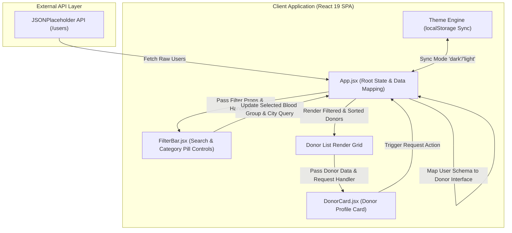

# Architecture & System Design

This document details the software architecture, data flow, component hierarchy, and state management of **Hema**.

---

## Technical Overview

Hema is structured as a client-side Single Page Application (SPA) designed for minimal latency and high availability. It leverages React 19 hooks for responsive state management and Vite 7 for build performance.



---

## Core Components

| Component | File Path | Primary Responsibility |
| :--- | :--- | :--- |
| **`App`** | [`src/App.jsx`](../src/App.jsx) | Root container, initial REST data fetching, donor mapping, multi-tier filtering logic, theme management. |
| **`FilterBar`** | [`src/components/FilterBar.jsx`](../src/components/FilterBar.jsx) | Blood group selection dropdown/filter controls and city search input text field. |
| **`DonorCard`** | [`src/components/DonorCard.jsx`](../src/components/DonorCard.jsx) | Displays donor name, blood type, city location, availability status, and interactive emergency request action button. |

---

## Data Model & Transformation

When the application mounts, `App.jsx` performs an asynchronous HTTP GET request to `https://jsonplaceholder.typicode.com/users`.

### Raw Input vs. Mapped Donor Entity

```typescript
// Transformed Internal Donor Model
interface MappedDonor {
  id: number;          // Unique user identifier
  name: string;        // Donor full name
  city: string;        // Donor city location (extracted from address.city)
  bloodGroup: string;  // Assigned blood type ("A+", "A-", "B+", "B-", "AB+", "AB-", "O+", "O-")
  available: boolean;  // Availability status (boolean flag)
  requested: boolean;  // Emergency request state
}
```

---

## Filtering & Sorting Strategy

Donor filtering operates in real time across two criteria with zero network lag:

1. **Blood Group Matching**: Filters donors by selected group or retains all if `"All"` is active.
2. **City Search**: Case-insensitive substring matching against `d.city`.
3. **Availability Priority Sorting**: Sorts available donors (`available: true`) ahead of unavailable donors (`available: false`).

---

## Persistence Layer

Hema stores user preferences locally in browser storage:
- **Key**: `"theme"`
- **Value**: `"dark"` | `"light"`
- **Body Class**: Toggles `.dark` class on `document.body` for CSS custom property overrides.
